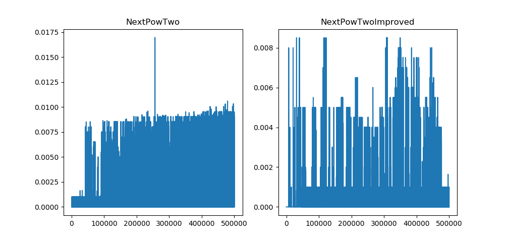
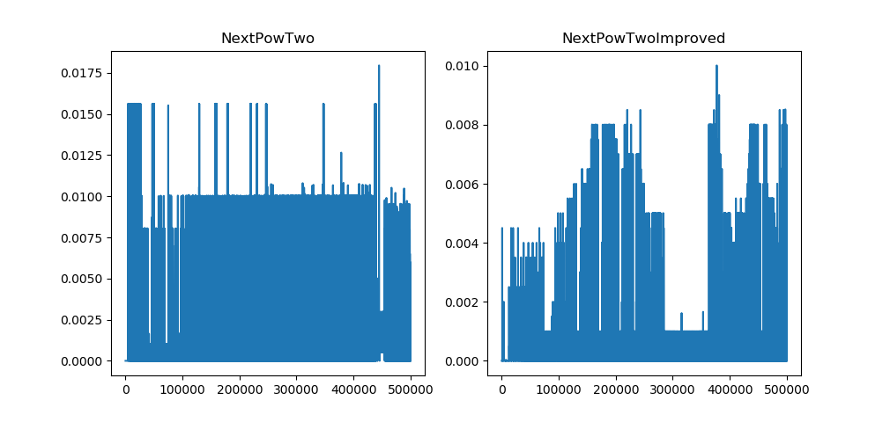

# Порівняння продуктивності генераторів в Python 

 _[English version](readme_en.md)_

Ідея для тесту проста і прийшла до мене в момент прочитання цієї [статті на Medium](https://medium.com/quick-code/advanced-python-made-easy-eece317334fa).

## Опис

Тест проведено лише для малого конкретного випадку використання ітератора для проблеми піднеcення числа `2` до степеня `n`.
Основна мета - порівняння різних підходів до вирішення цієї проблеми:

1) обчислювати 2^n коженого разу -- `NextPowTwo`
2) або просто множити на 2 на кожному наступному кроці -- `NextPowTwoImproved`.

Також виконано обидві реалізації функціональності ітераторів.
Генератор ініціалізується з максимальним значенням степеня двійки, до якого можна буде отримувати значення. Кожного разу, коли він викликається, повертає наступне значення степеня двійки.

## Приклад

Максимальний очікуваний степінь - 4: `n_max=4`.

Послідовні виклики функції (ітератора):
* 1-ий: `n=0`, `2^n=1`
* 2-ий: `n=1`, `2^1=2`
* 3-ий: `n=2`, `2^2=4`
* 4-ий: `n=3`, `2^3=8`
* 5-ий: `n=4`, `2^4=16`
* 6-ий: `n=5`, n > n_max -> `raise StopIteration`

## Реалізація (Імплементація)

Цю функціональність можна реалізувати, використовуючи класи або в більш "пітонічний" спосіб, просто використовуючи слово `yield`. Обиді з них можна знайти тут.

## Що вимірюється?

`Час для кожного наступного виклику` функції і `загальний час` аж поки не буде досягнуто останній степінь.

## Результати

### Реальзація за допомогою класів

| функція | час |
| --- | --- |
| NextPowTwo | 345.60083866119385 |
| NextPowTwoImproved | 5.034592628479004 |

### Реальзація з використанням `yield`

| функція | час |
| --- | --- |
| NextPowTwo | 336.7887933254242 s |
| NextPowTwoImproved | 4.948707342147827 s |

## Висновки і мораль

В обох реалізаціях підхід з простим множенням на 2 замість обчислення 2 до n-го степеня набагато швидший (~ в 50 разів). Це показує, що іноді незначне прямолінійне покращення може мати значний вплив, хоча це і було синтетичною проблемою.

Реалізація з `yield` показала трохи кращий час. Щоб бути впевненим, що такий підхід завжди дає кращий результат, нам слід повторити один і той же експеримент в різних середовищах по декілька разів і усереднити результати. Але в будь-якому разі, використання `yield` набагато краще, тому що це простіше реалізувати та легше читати. Не забувайте - код спочатку повинен бути читабельним.

---------------------------------

Будь ласка, повідомляйте про помилки через `issues`.
