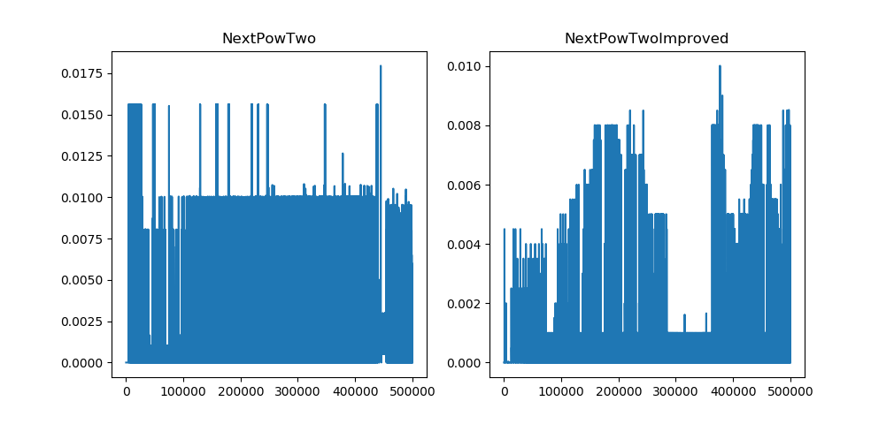

# Performance comparison of generators in Python 

 _[Українська версія](readme.md)_

The idea for test is simple and came to me at the moment of reading this [article on Medium](https://medium.com/quick-code/advanced-python-made-easy-eece317334fa).

## Description
Test is done for only the very little specific use case of iterator: for raising number `2` to the `n`-th power.
Main aim is to compare different approaches to solve this problem:

1) compute 2^n each time -- `NextPowTwo`
2) or just multiply by 2 on each consecutive step -- `NextPowTwoImproved`.

Also both implementation of iterators functionality is done.
Generator is created with maximum value of power of 2 to be generated. Each time it is called it returns the next power of 2.

## Example
Maximum power expected is 4: `n_max=4`.

Consecutive calls of function:
* 1st: `n=0`, `2^n=1`
* 2nd: `n=1`, `2^1=2`
* 3rd: `n=2`, `2^2=4`
* 4th: `n=3`, `2^3=8`
* 5th: `n=4`, `2^4=16`
* 6th: `n=5`, n > n_max -> `raise StopIteration`

## Implementation

This functionality can be implemented using `class`es or more pythonic way simply using `yield`. Both of them can be found here.

## What is measured?

`Time for each consecutive call` of function and `total time` until reaching maximum value.

## Results

### Class implementation

| function | time |
| --- | --- |
| NextPowTwo | 345.60083866119385 |
| NextPowTwoImproved | 5.034592628479004 |

### Implementation using `yield`

| function | time |
| --- | --- |
| NextPowTwo | 336.7887933254242 s |
| NextPowTwoImproved | 4.948707342147827 s |

## Conclusion and moral

In both implementations approach with simple multiplying by 2 instead of calculating 2 to the n-th power is much faster (~50 times). This shows that sometimes minor straightforward improvement can have considerable impact aven though this was synthetic problem.

Implementation with `yield` showd a bit better time. To be sure that this approach is always gives better result we should repeat the same experiment in different environments several times and get average. But anyway, using `yield` is much better because it is simplier to implement and to read. Do not forget code must be readable first.

---------------------------------

Please, report bugs via issues.
