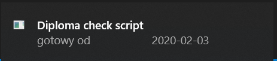

# USOS diploma status checker

## Usage

1. Encode your `login` and `pass` with [credentials_encode.ipynb](credentials_encode.ipynb)
2. Run [check_diploma_debug_notebook.ipynb](check_diploma_debug_notebook.ipynb) or [usosweb_diploma_checker.py](usosweb_diploma_checker.py)
3. Automate your task wih `MS Task Scheduler`

## About

`USOSWeb` is a system for students in Warsaw University of Technology. Your study progress, grades, certificates, diplomas etc. can be checked there. I did want to log in every time there, because it was tedious.

On scheduled time you will get a tooltip in Windows (Win10 tested) and get a string in a log file.

Scheduler runs the task sometimes not in precise time, but quite regularly. If PC is on and logged in, it will be fine. I put my log straight on a Desktop to check file from time to time if I was away from computer.

You can set your task as you wish, obviously. :)

## Examples

* credential_example.txt - encoded login and password
* diploma_checks_example.log - how checks are logged (simply: `data-time`: `message scraped from page`)
* tooltip

